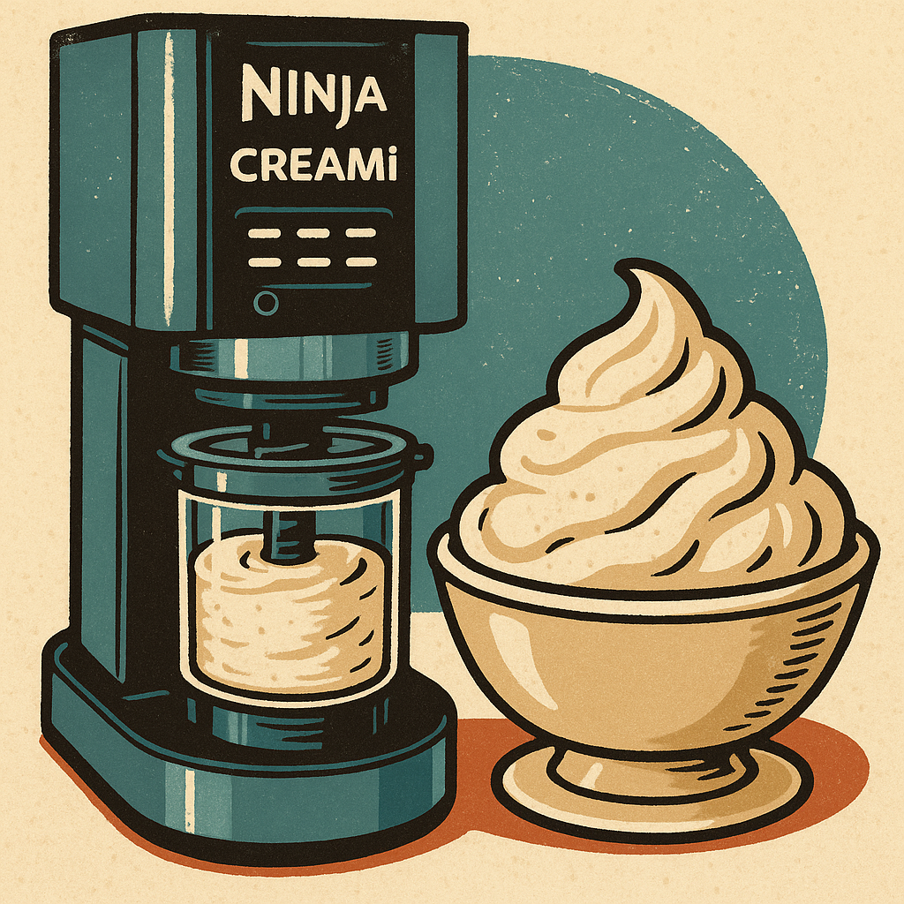

# 🍨 Best Ninja Creami Ice Cream Recipes

## 📌 Table of Contents
- [🍦 Classic Favorites](#-classic-favorites)
- [🍫 Indulgent Mix‑Ins](#-indulgent-mix-ins)
- [💪 High‑Protein & Low‑Sugar Options](#-high-protein--low-sugar-options)
- [✨ Unique & Fun Ideas](#-unique--fun-ideas)
- [🔥 Tips for Creamier Results](#-tips-for-creamier-results)

---

## 🍦 Classic Favorites

✅ **Vanilla Bean Ice Cream**  
**Base:**  
- 1 cup whole milk  
- 1 cup heavy cream  
- ½ cup sugar  
- 1 tsp vanilla bean paste or extract  
- Pinch of salt  
*Tip: Chill overnight for deeper vanilla flavor.*

✅ **Chocolate Fudge Ice Cream**  
**Base:**  
- 1 cup whole milk  
- ½ cup heavy cream  
- ½ cup sweetened condensed milk  
- ¼ cup unsweetened cocoa powder  
- Pinch of salt  
*Pro tip: Add 2 Tbsp chocolate syrup before freezing for extra ribbons.*

---

## 🍫 Indulgent Mix‑Ins

✅ **Cookies & Cream** – Use vanilla base, then after first spin add crushed Oreos and run **Mix‑In**.  
✅ **Salted Caramel Pretzel** – Use vanilla or caramel base, then after first spin fold in chopped pretzels and drizzle caramel, sprinkle flaky salt, run **Mix‑In**.  
✅ **Peanut Butter Cup** – Use chocolate base, then after first spin add chopped peanut butter cups and run **Mix‑In**.

---

## 💪 High‑Protein & Low‑Sugar Options

✅ **Protein Vanilla Ice Cream**  
**Base:**  
- 1 scoop vanilla protein powder  
- 1 cup Fairlife (or similar)  
- 2 Tbsp sugar‑free pudding mix (vanilla)  
- 1 Tbsp sugar‑free syrup (optional)  
*Tip: Blend smooth before freezing; add a splash of cream if too icy.*

✅ **Chocolate Peanut Butter Protein Ice Cream**  
**Base:**  
- 1 scoop chocolate protein powder  
- 1 cup Fairlife chocolate milk  
- 1 Tbsp unsweetened cocoa  
- 2 Tbsp powdered peanut butter (PB2)  
*Optional: Sweeten with stevia or monk fruit.*

---

## ✨ Unique & Fun Ideas

✅ **Matcha Green Tea Ice Cream**  
**Base:**  
- 1 cup half‑and‑half  
- ½ cup sweetened condensed milk  
- 1–2 tsp matcha powder (whisk well)  
- ½ tsp vanilla  
*Mix‑In: White chocolate chips after first spin.*

✅ **Espresso Coffee Crunch**  
**Base:**  
- 1 cup whole milk  
- ½ cup cream  
- 2 Tbsp instant espresso powder  
- ½ cup sweetened condensed milk  
- ½ tsp vanilla  
*Mix‑In: Crushed chocolate‑covered espresso beans.*

✅ **Strawberry Cheesecake**  
**Base:**  
- 1 cup whole milk  
- 2 oz cream cheese (softened)  
- ¼ cup sugar  
- ½ tsp lemon juice  
- ½ tsp vanilla  
*Mix‑In: Chopped strawberries and graham cracker crumbs.*

---

## 🔥 Tips for Creamier Results

✅ Use a balanced fat base (whole milk + cream or Fairlife)  
✅ Blend until completely smooth before freezing  
✅ Freeze flat and solid (24 hours)  
✅ If crumbly after first spin, add 1–2 Tbsp milk and respin  
✅ Use **Mix‑In** for cookies, nuts, or candy

🍦💛 *Happy spinning!*
